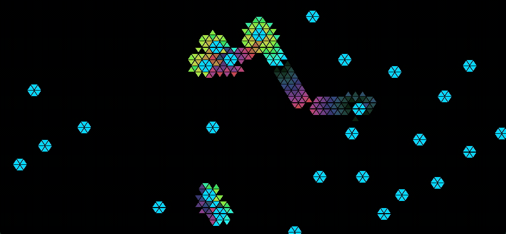
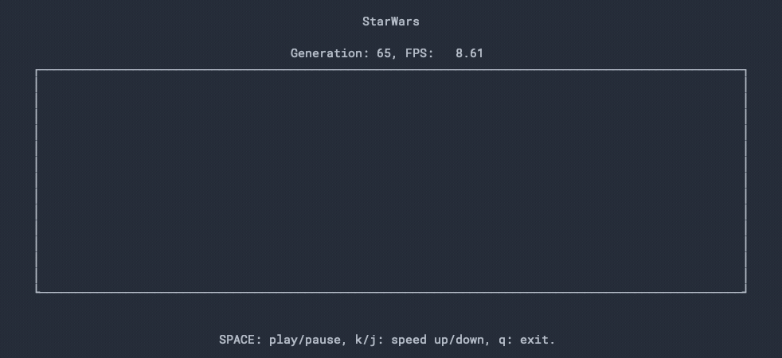

# Goo-GoL-Conway

A highly configurable Cellular Automaton framework (John Conway's Game of Life on steroids).

Sadly Conway passed away on April 11, 2020 due to COVID-19. This project is a tribute to him for his contribution to mathematics, [Google Conway](https://www.google.com/search?q=john+conway) to learn more about his work.





## Dependencies

This program has been (not rigorously) tested on some Linux, macOS and Windows platforms, the following steps should work for all three platforms.

Dedicated GPU hardware is preferred for faster rendering but not required.

### Ubuntu

```bash
# Install Shaderc dependencies.
$ apt install build-essential cmake git ninja python3

# Install Vulkan SDK (NVIDIA GPU only).
$ apt install vulkan-utils

# Install Vulkan SDK (AMD GPU only).
$ apt install libvulkan1 mesa-vulkan-drivers vulkan-utils

# Optional: install NCURSES for ASCII rendering support.
$ apt install libncurses5-dev libncursesw5-dev
```

For other Linux distros, follow [this tutorial](https://linuxconfig.org/install-and-test-vulkan-on-linux) to install Vulkan SDK.

### macOS

Install [Xcode](https://developer.apple.com/xcode/) and [Homebrew](https://brew.sh/) if you do not already have them. If it is your first time installing Xcode, it will prompt you to install additional components after launching it, select "yes" to install required dependencies.

```bash
# Install Shaderc dependencies.
$ brew install git cmake git ninja python@3.8

# Optional: install NCURSES for ASCII rendering support.
$ brew install ncurses
```

### Windows

Install [Visual Studio](https://visualstudio.microsoft.com/downloads/), [CMake](https://cmake.org/download/), [Python3.8](https://www.python.org/downloads/release/python-389/).

## Installation

### Rust

If you do not already have Rust installed on your system, please follow the official Rust [installation documentation](https://www.rust-lang.org/tools/install) to install it.

It is good practice to run `rustup update` to make sure your Rust toolchain is up to date before installing this program. From here, you can choose to either do a simple installation using Cargo (recomended) or build from source.

### Using Cargo

```bash
$ cargo install gol-client
```

If the installation fails, You may see prompts to install other dependencies during the installation, 

### Build from Source

```bash
# Clone respository
$ git clone git@github.com:shuyangsun/goo-gol-conway.git

# Change working directory
$ cd goo-gol-conway

# Update crates index
$ cargo update

# Build
$ cargo build --release

# Check instruction
$ ./target/release/gol --help
```

#### ASCII Rendering

In almost all use cases graphical rendering is desired, however sometimes limitations of the system may not allow a graphical representation (e.g., remote into a Linux terminal). In these situations you can still display grid-based two-dimensional Cellular Automaton systems with ASCII characters utilizing [NCURSES](https://tldp.org/HOWTO/NCURSES-Programming-HOWTO/) library. This library is only available on UNIX platforms, that is why it is not enabled by default.

To enable support for ASCII rendering, you need to install NCURSES first, and since the installation step is platform-dependent, we will not cover that in this document. After installing NCURSES, simply install the program with `cargo install gol-client --features ascii`, or build from source `cargo build --features ascii --release`.

## Usage

```bash
# Check command-line argument options (and available demos).
$ gol --help

# Run a demo.
$ gol --demo starwars

# Run a demo, but in triangular mode.
$ gol --demo bombers --triangular

# Run from a JSON configuration file, checkout help message for examples.
$ gol --config /path/to/config.json

# Saving run result.
$ gol --config /path/to/config.json --save /path/to/empty/directory

# Replay from saved data.
$ gol --replay /path/to/replay/directory

# Replay using triangular rendering
$ gol --replay /path/to/replay/directory --triangular
```

### Playback Control Options

| Input | Functionality | Live | Replay |
| - | - | - | - |
| Mouse Scroll | Zoom | Yes | Yes |
| Mouse Drag | Pan | Yes | Yes |
| Double Click | Reset Canvas | Yes | Yes |
| `SPACE` | Play/Pause | Yes | Yes |
| `J` | 0.5x Slow Down | Yes | Yes |
| `K` | 2x Speed Up | Yes | Yes |
| `H` (playing) | Play Backward | No | Yes |
| `L` (playing) | Play Forward | No | Yes |
| `H` (paused) | One Step Backward | No | Yes |
| `L` (paused) | One Step Forward | No | Yes |
